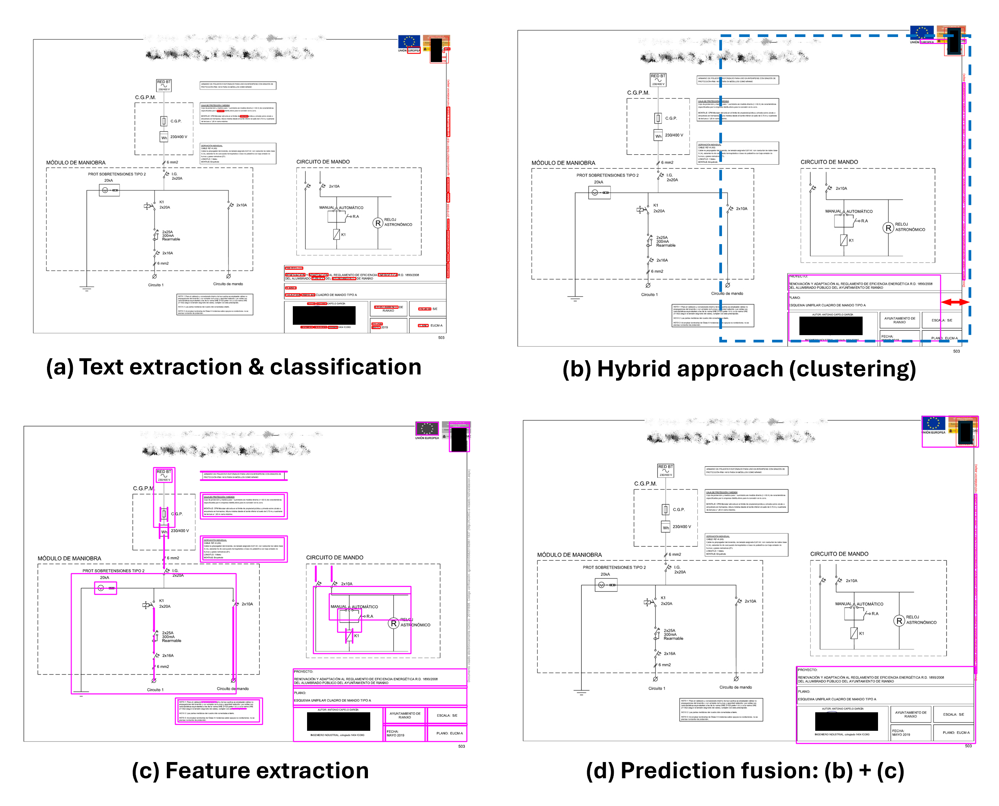

# anonED overview
A training free method for anonymising sensitive regions in complex engineering diagrams.

<p align="center">
    
<i>AnonED Method Visualization (dictionary text classification).</i>
</p>

LLM-based classification demo for the ICDAR 2025 Workshop paper titled `AnonED: Complex Region Anonymisation in Electrical Diagrams using Hybrid Density-Based Spatial Clustering`

`samples` folder contains non-standard objects without background to simulate occlusion on different drawing types

# Data
Datasets for validation

## Piping and Instrumentation Diagram (P&ID) Table Detection Dataset. Available [here](https://universe.roboflow.com/tblocr/table_det-ixptg)

```bibtex
@misc{table_det-ixptg_dataset,
title = { Table_Det Dataset },
type = { Open Source Dataset },
author = { TBLOCR },
url = { https://universe.roboflow.com/tblocr/table_det-ixptg },
journal = { Roboflow Universe },
publisher = { Roboflow },
year = { 2024 },
month = { may },
note = { visited on 2025-02-21 },
}
```
## Synthetic Manufacturing Raster Diagrams (Engineering Drawing Information Extractor). Available [here](https://github.com/Bakkopi/engineering-drawing-extractor)

```bibtex
@misc{Bakkopi2023,
   author = {Bakkopi},
   journal = {Github},
   month = {8},
   title = {Engineering Drawing Extractor},
   url = {https://github.com/Bakkopi/engineering-drawing-extractor},
   year = {2023}
}
```
# To replicate on other diagram types

1. Use sample images to generate a dictionary from the notebook `llm_dictionary.py` (note: requires OpenAI API key)
2. Replace file paths, Laplaian variance threshold and tessaract ocr language settings in the notebook `anoned_fusion.py`

Note: Results in image were generated using a traditional dictionary. Demo results will vary (i.e., LLM-generated dictionary)

# References
To cite the demo code:

```bibtex
@InProceedings{onabanjo2025anoned,
title={AnonED: Complex Region Anonymisation in Electrical Diagrams using Hybrid Density-Based Spatial Clustering},
author={Onabanjo, Olumayowa and Moreno-García, Carlos Francisco and Martinez-Huerta, Gemma and Díaz Piloñeta, Marina and Ortega-Fernández, Francisco},
booktitle={Document Analysis and Recognition -- ICDAR 2025 Workshops},
year={2025},
publisher={Springer Nature Switzerland},
address={Cham},
pages={X--XX},
}
```
